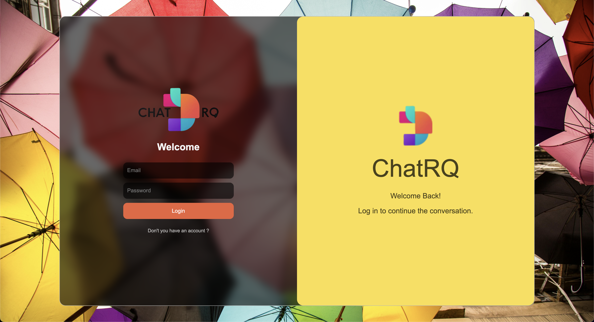
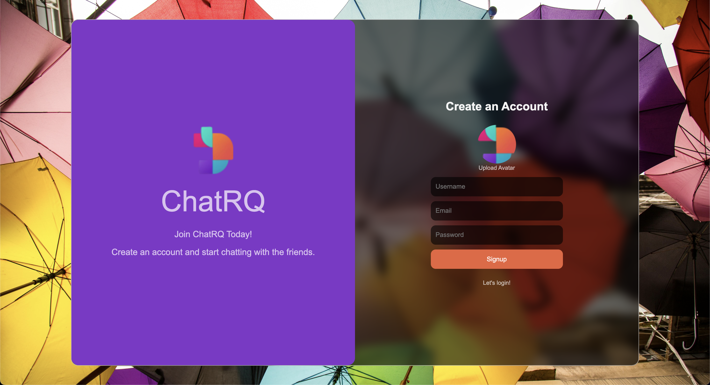

# Chat-RQ: Real-Time Chat Application

## 📱 Screenshots

### Authentication
<p float="left">
  
  
</p>

### Chat Interface
<p float="left">
  
  
  
</p>

### Features
<p float="left">
  
  
  
</p>

### Voice Recording
<p float="left">
  
  
</p>

## 📝 Project Description

Chat-RQ is a real-time chat application developed using modern web technologies. Built on Firebase infrastructure, the application enables users to exchange instant messages, share photos, share your captured photo, voice record, and use emojis.

## 🚀 Features

- 👤 User authentication system
- 💬 Real-time messaging
- 🎙️ Voice record
- 📹 Webcam image capture
- 📸 Photo, voice, captured image sharing, downloading and viewing
- 😊 Emoji support
- 📥 Image download

## 🛠️ Technologies

- **Frontend Framework:** React.js
- **Build Tool:** Vite
- **Backend/Database:** Firebase
- **State Management:** Zustand
- **UI Components:**
  - emoji-picker-react
  - react-webcam
  - react-toastify
  - timeago.js

## 📦 Installation

1.Clone the project:

```bash
git clone [repo-url]
```

2.Install dependencies:

```bash
npm install
```

3.Create `.env` file and add your Firebase configuration:

```env
VITE_FIREBASE_API_KEY = "api-key"
VITE_CLOUDINARY_UPLOAD_URL = "api-url"
VITE_CLOUDINARY_UPLOAD_PRESET = "cloudinary-preset-name"
VITE_CLOUDINARY_FOLDER = "folder-name"
VITE_CLOUDINARY_CHATFILES_FOLDER = "folder-name"

```

4.Start the development server:

```bash
npm run dev
```

## 🏗️ Project Structure

```plaintext
chat-rq/
├── src/
│   ├── components/         # UI components
│   │   ├── chat/          # Chat interface
│   │   ├── detail/        # Detail view
│   │   ├── list/          # Chat list
│   │   ├── login/         # Login screen
│   │   └── notification/  # Notification system
│   ├── lib/               # Firebase configuration
│   ├── stores/            # Zustand state management
│   └── assets/            # Static files
├── public/                # Public files
└── dist/                  # Build output
```

## 📜 Commands

- `npm run dev`: Start development server
- `npm run build`: Build project for production
- `npm run lint`: Run ESLint code checks
- `npm run preview`: Preview build output

## 🔒 Security

- Secure user management with Firebase Authentication
- Online/offline status tracking
- Secure file sharing and storage

## 🤝 Contributing

1. Fork the project
2. Create a feature branch (`git checkout -b feature/amazing-feature`)
3. Commit your changes (`git commit -m 'feat: Add amazing feature'`)
4. Push to the branch (`git push origin feature/amazing-feature`)
5. Open a Pull Request

## 📄 License

This project is licensed under the MIT License.
